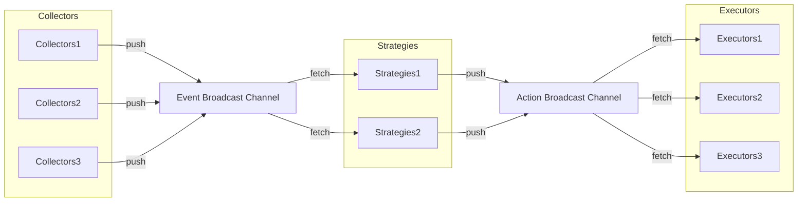

# Engine
> forked and modified from: https://github.com/tonyke-bot/burberry/tree/b0a652dc7b2733910f41760e1ae9d26010fe49f7

```mermaid
graph LR

    subgraph Collectors
        Collectors1
        Collectors2
        Collectors3
    end
    
    C1[Event Broadcast Channel]
    Collectors1 -->|push| C1
    Collectors2 -->|push| C1
    Collectors3 -->|push| C1

    subgraph Strategies
        Strategies1
        Strategies2
    end

    C1 --> |fetch| Strategies1
    C1 --> |fetch| Strategies2
    
    C2[Action Broadcast Channel]
    Strategies1 -->|push| C2
    Strategies2 -->|push| C2

    subgraph Executors
        Executors1
        Executors2
        Executors3
    end

    C2 --> |fetch| Executors1
    C2 --> |fetch| Executors2
    C2 --> |fetch| Executors3
```